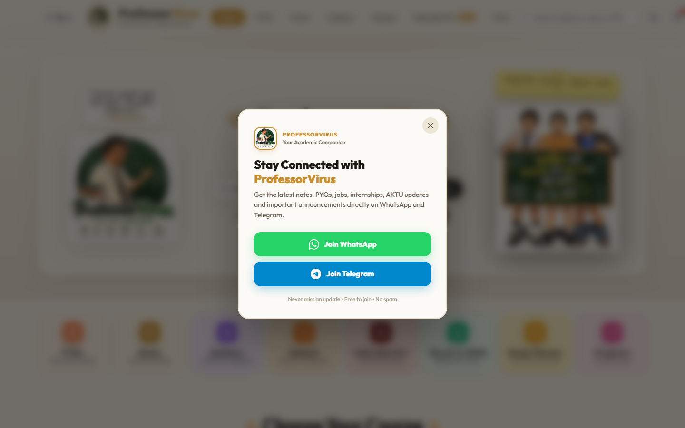
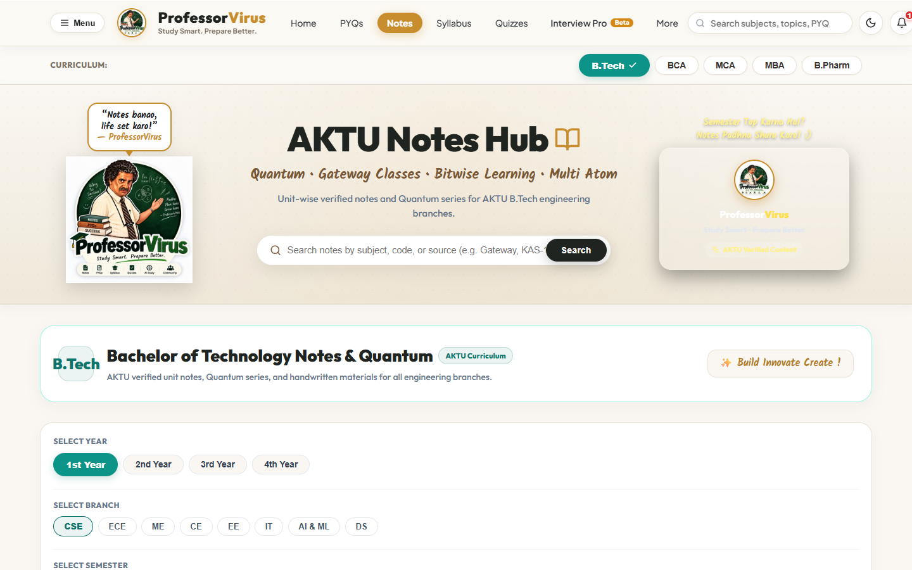
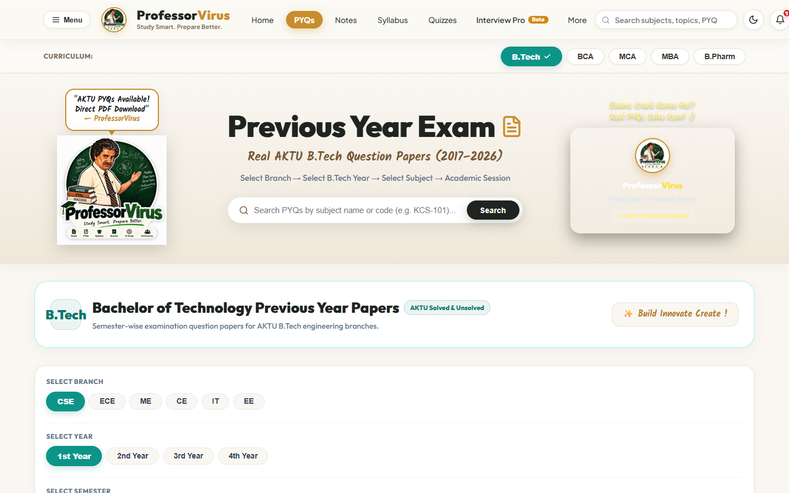
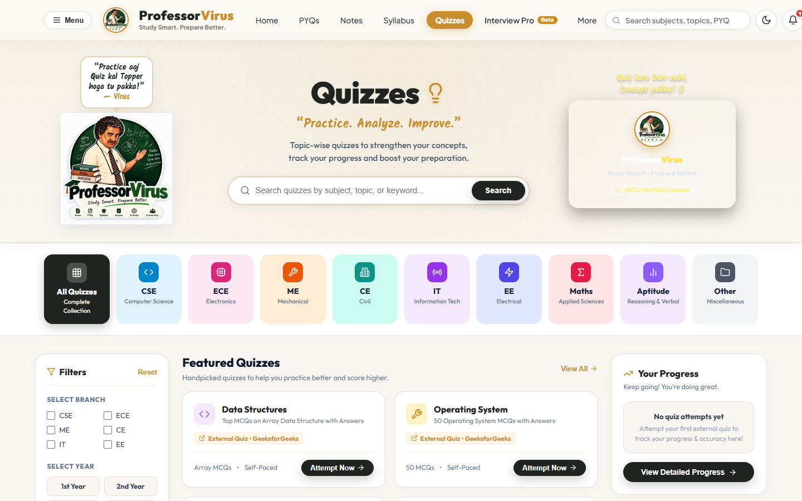
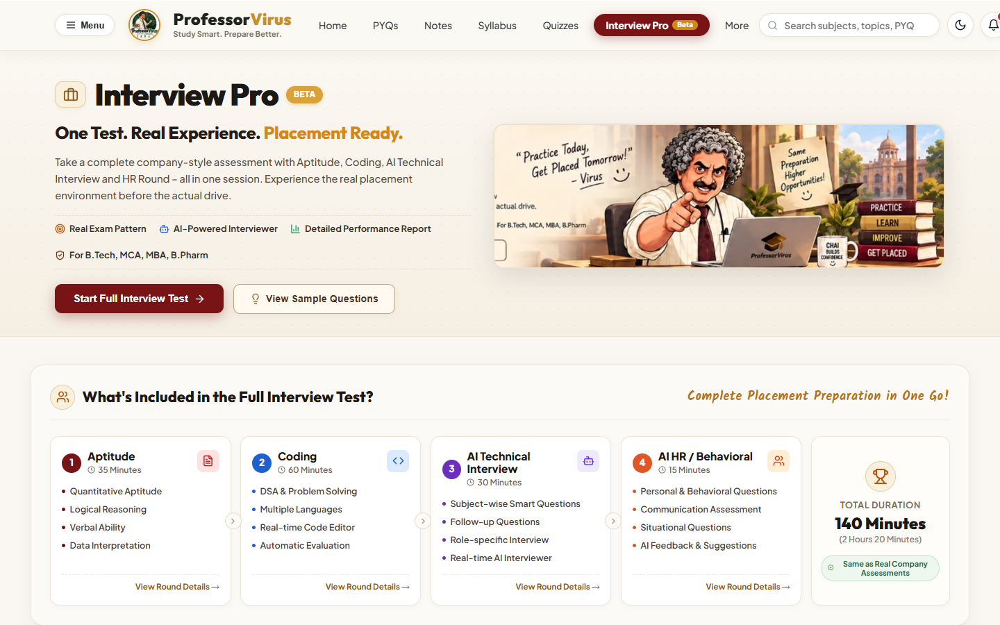
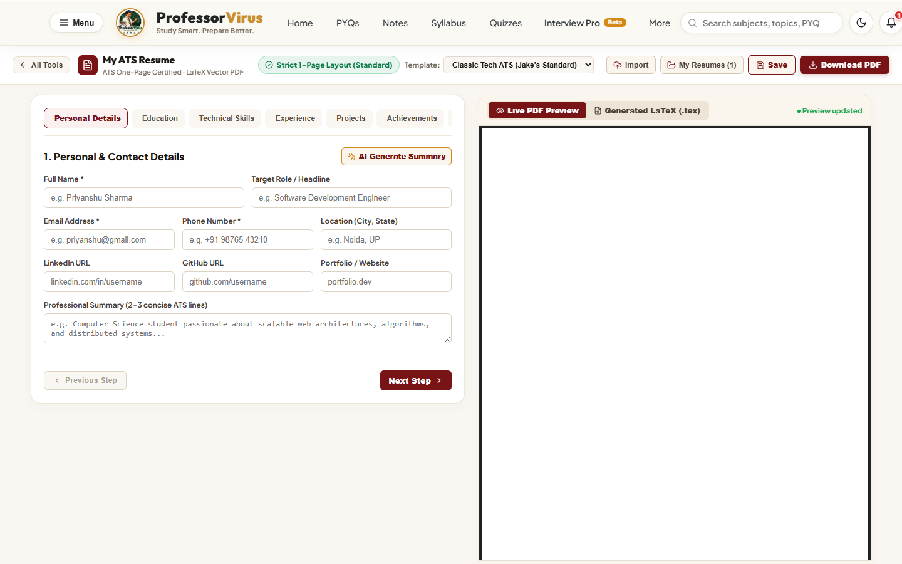
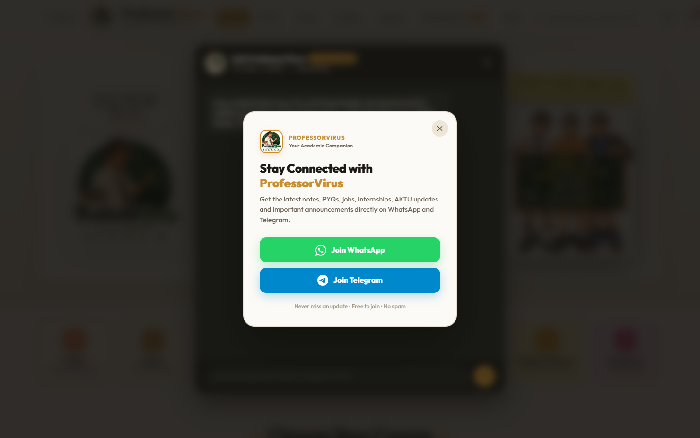
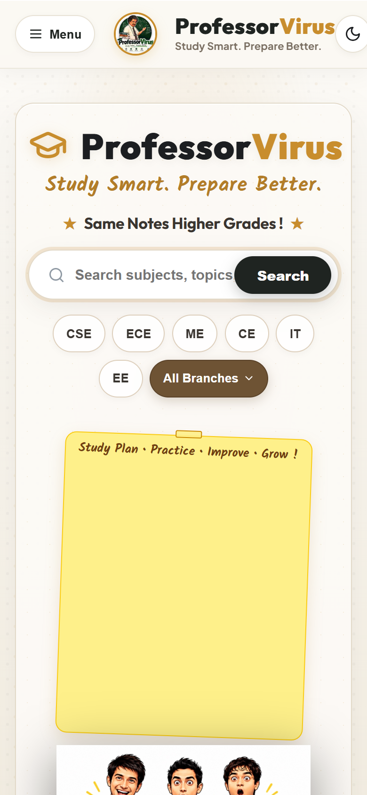
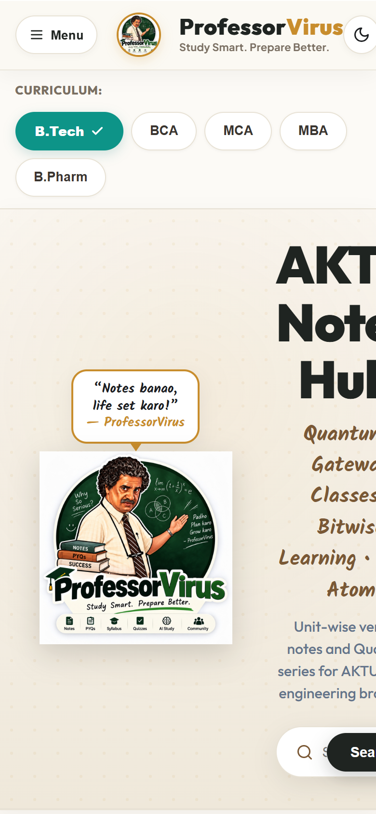
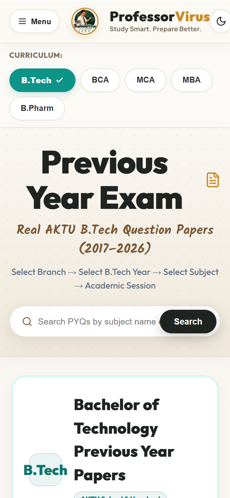

# CampusPrep

CampusPrep (also known as ProfessorVirus) is an all-in-one educational platform engineered for undergraduate engineering and computer application students (AKTU B.Tech & BCA). It empowers students with verified handwritten notes, solved previous year question papers (PYQs), comprehensive syllabi, interactive quizzes, an AI-powered study companion (**Ask Virus**), and an end-to-end recruitment preparation suite (**Interview Pro**).

---

## Features

- **Academic Hub**: Fast, course-wise categorization across Computer Science, Electronics, Mechanical, Civil, and BCA.
- **Verified Notes**: Unit-wise and topic-wise lecture notes, Quantum guides, and teacher-recommended reference PDFs.
- **Previous Year Question Papers (PYQs)**: Organized question papers with university exam session filters, solution keys, and direct preview/download.
- **Interactive Quizzes**: Unit-level and subject-level practice tests with immediate scoring, answer reviews, and explanations.
- **Global Search**: Instant cross-platform search across thousands of academic resources, subjects, and papers.
- **Attendance & Timetable Planners**: Dynamic college attendance target calculators and weekly class schedule planners.
- **Scholarships & Opportunities**: Curated repository of government/private scholarships and internship opportunities.
- **Dark/Light Theming & Modern Responsive UI**: Glassmorphic styling, intuitive desktop, tablet, and mobile layouts.

---

## AI Features

- **Ask Virus (AI Study Assistant)**: Context-aware study partner powered by server-side OpenAI integration (`gpt-4o-mini`). Students can ask conceptual questions, summarize unit notes, and clarify difficult exam problems on-demand.
- **Secure Architecture**: All AI requests are mediated via secure backend proxies with rate-limiting, timeout guards, and strict protection of API credentials.

---

## Interview Pro

A complete simulation suite for campus placement and job recruitment rounds:

1. **Aptitude Assessment**: Quantitative, logical reasoning, and verbal practice rounds with timer constraints.
2. **Coding Challenge**: Interactive code editor supporting popular languages with automated sample test cases.
3. **AI Technical Interview**: Role-focused technical viva asking architecture, algorithmic, and core computer science questions.
4. **AI HR / Behavioral Interview**: Situational, leadership, and behavioral questions with instant feedback.
5. **Comprehensive Performance Report**: Detailed score breakdown, strengths, areas for improvement, and round-wise evaluation summaries.

---

## Resume Builder

- **ATS-Friendly Templates**: Professional LaTeX and standard layouts optimized for applicant tracking systems.
- **Live Preview & Customization**: Real-time rendering of education, projects, technical skills, certifications, and work experience.
- **Direct Export**: One-click download of polished resume documents ready for job applications.

---

## Study Resources

- **B.Tech (AKTU)**: 1st Year Foundations, CSE/IT, ECE, Mechanical, and Civil Engineering core curriculum coverage.
- **BCA**: Standardized university semester subjects from Programming in C/Java, Operating Systems, Computer Networks, to Cloud Computing and Software Engineering.
- **Quantum Series & Notes**: Direct access to exam-focused Quantum modules and curated handwritten notes.

---

## Screenshots

### Home


### Notes


### PYQs


### Quizzes


### Interview Pro


### Resume Builder


### Ask Virus


### Mobile Experience

| Mobile Home | Mobile Notes | Mobile PYQs |
| :---: | :---: | :---: |
|  |  |  |

---

## Tech Stack

- **Frontend**: React 18, Vite, Vanilla CSS & Modern Design System, Lucide Icons
- **Backend**: Node.js, Express.js (REST API, CORS protection, rate-limiting, PDF utilities)
- **Database**: MongoDB Atlas with Mongoose ODM (with seamless disk-based fallback mode)
- **AI Engine**: OpenAI API (`gpt-4o-mini`) via backend middleware
- **Authentication**: JWT (JSON Web Tokens) with bcrypt password hashing

---

## Project Structure

```
CampusPrep/
├── docs/
│   └── screenshots/              # Real application screenshots
├── public/                       # Static public assets & PDFs
├── server/                       # Node.js / Express backend
│   ├── models/                   # Mongoose data models
│   ├── routes/                   # API route controllers
│   ├── resultEngine/             # AKTU marksheet & CGPA parsing engine
│   └── index.js                  # Main server entry point
├── src/                          # React client application
│   ├── components/               # Reusable UI components & modals
│   ├── config/                   # Client-side configuration
│   ├── data/                     # Offline catalog & fallback banks
│   ├── pages/                    # Primary application route pages
│   ├── utils/                    # Client helper utilities
│   ├── App.jsx                   # Main React entry & tab router
│   ├── index.css                 # Global design system & typography
│   └── main.jsx                  # React DOM mount point
├── .env.example                  # Environment variable reference
├── .gitignore                    # Git exclusion rules
├── package.json                  # Dependencies and execution scripts
├── render.yaml                   # Render deployment configuration
└── vite.config.js                # Vite build configuration
```

---

## Getting Started

### Prerequisites

- Node.js (v18.0.0 or higher recommended)
- npm or yarn

### Installation

1. Clone the repository:
   ```bash
   git clone https://github.com/priyanshukumar09546-cpu/CampusPrep.git
   cd CampusPrep
   ```

2. Install dependencies:
   ```bash
   npm install
   ```

3. Configure environment variables (see below).

4. Start development mode (concurrently runs backend server & Vite frontend):
   ```bash
   npm run dev
   ```

5. Access the application in your browser at `http://localhost:3000`.

---

## Environment Variables

Create a `.env` file in the project root based on `.env.example`:

```env
# MONGODB ATLAS CONNECTION URI
MONGODB_URI=your_mongodb_connection_uri

# BACKEND SERVER PORT & JWT SECRET
PORT=5000
JWT_SECRET=your_jwt_secret_key_here

# FRONTEND URL (FOR CORS)
FRONTEND_URL=http://localhost:3000

# OPENAI API KEY (SERVER-SIDE ONLY)
OPENAI_API_KEY=your_openai_api_key
OPENAI_MODEL=gpt-4o-mini

# SEED ADMIN CREDENTIALS
ADMIN_EMAIL=your_admin_email
ADMIN_PASSWORD=your_admin_password
ADMIN_NAME=CampusPrep Administrator

# GOOGLE DRIVE INTEGRATION (OPTIONAL)
GOOGLE_CLIENT_ID=your_google_client_id
GOOGLE_CLIENT_SECRET=your_google_client_secret
GOOGLE_REDIRECT_URI=http://localhost:5000/api/google-drive/callback
GOOGLE_DRIVE_FOLDER_ID=your_google_drive_folder_id
```

---

## Security

- **Zero Client-Side Secrets**: All sensitive credentials (such as `OPENAI_API_KEY`, `MONGODB_URI`, `JWT_SECRET`) reside strictly in server-side environment variables. No secrets are bundled into client-side Vite builds or exposed through `VITE_` variables.
- **Git Protection**: Sensitive environment files (`.env`, `.env.local`, `*.env`) and private logs are strictly excluded via `.gitignore`.
- **CORS & Rate Limiting**: The backend is configured to accept requests only from designated frontend origins with appropriate timeout boundaries.

---

## Deployment

The intended production architecture for CampusPrep:

- **Frontend**: Hosted on [Vercel](https://vercel.com) for edge distribution and performance.
- **Backend API**: Hosted on [Render](https://render.com) using the included `render.yaml` configuration.
- **Database**: Cloud-hosted [MongoDB Atlas](https://www.mongodb.com/atlas) cluster.
- **AI Services**: [OpenAI API](https://platform.openai.com) accessed through backend proxy routes.
